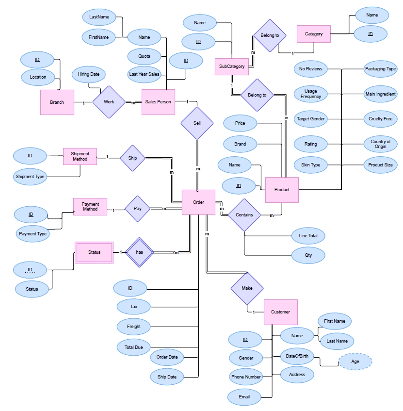
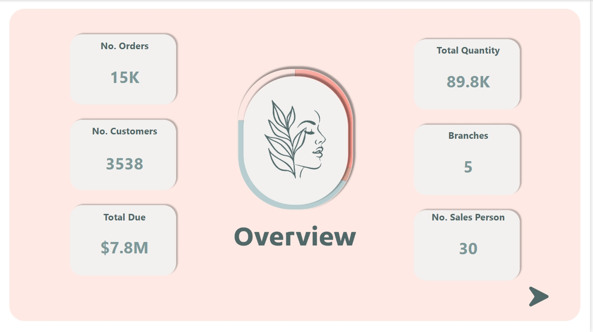
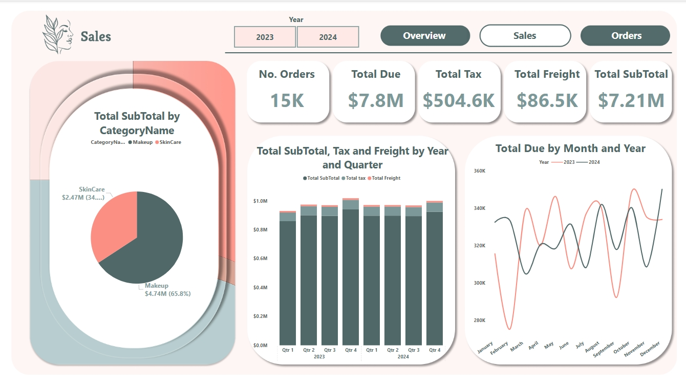
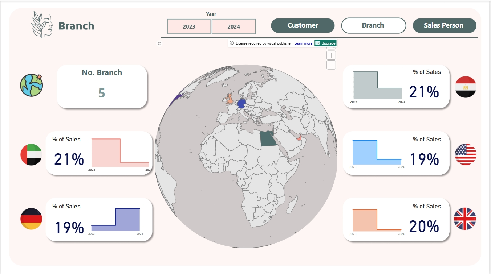

# 💄 Cosmetics Sales Analytics Project

A complete end-to-end Business Intelligence & Web Development solution for the cosmetics industry, built during the ITI Intensive Code Camp.

## 📊 Overview

In today’s competitive cosmetics market, understanding customer behavior and product performance is essential. This project delivers a dynamic Power BI dashboard and a responsive e-commerce website to support data-driven decision-making and enhance customer engagement.

---

## 🎯 Objectives

- Provide **interactive analytics** on sales, products, branches, and customers.
- Enable **online visibility and product purchases** through a responsive website.
- Combine marketing insights with user behavior data.
- Offer **stakeholders** clear and visual summaries of KPIs.

---

## 🧑‍🤝‍🧑 Stakeholders

- Business Owners & Executives
- Sales & Marketing Team
- BI/Data Analysts
- Web Development Team
- End Customers

---

## 🔍 Key Features

### 📈 Power BI Dashboards

- **Overview**: KPIs summary (orders, customers, branches, sales).
- **Sales Performance**: Subtotal, tax, and freight by time.
- **Orders Analysis**: Cancellations, payment methods, quantity, and locations.
- **Customer Insights**: Demographics, locations, behavior.
- **Product Performance**: Ratings, forecasts, origin countries.
- **Category & Brand Performance**: Best-selling categories and brands.
- **Skin Type, Gender & Age Analysis**: Targeted insights.
- **Salesperson & Shipping Insights**: Performance tracking and preferences.
- **SSRS Reports**: Paginated, printable reports.

### 🛍️ Website Features

- Responsive UI/UX for mobile and desktop.
- Product catalog with filters.
- Shopping cart and checkout.
- Secure customer login and contact form.
- Admin panel for product/order management.

---

## ⚙️ Technologies Used

| Area             | Tools / Languages                        |
|------------------|-------------------------------------------|
| Dashboard        | Power BI, DAX, Power Query                |
| Reporting        | SSRS                                      |
| DataBase         | SQL Server                                |
| Data Warehouse   | SQL Server, SSIS                          |
| Data Scripting   | Python                                    |
| Website Frontend | HTML, CSS, JavaScript                     |
| Website Backend  | Node.js                                   |
| Version Control  | Git & GitHub                              |

---

## 🛠️ Data Architecture

- **Snowflake schema** database design with SalesOrder as fact table.
- **ERD & mapping** defined relationships between products, customers, and branches.
- **ETL pipeline** using SSIS to clean, transform, and load raw Excel data.
- **Stored procedures** to automate metric calculations and validations.

---

## 🧪 Data Sources

- Real Data: The Product table was provided as the actual dataset.
- Synthetic data generation using Python & AI.
- Multiple Excel files consolidated and standardized.

---

## 🔐 Assumptions & Risks

- Assumes clean and consistent data across branches.
- Risks include data quality issues, integration delays, and user adoption resistance.

---

## 🔮 Future Enhancements

- 🔗 Payment Gateway Integration (Visa, PayPal, Vodafone Cash).
- 🤖 AI Recommendation Engine.
- 📱 Mobile App (Flutter or React Native).
- 🧠 Predictive Analytics (Azure ML).
- 🌐 Multi-language Website (Arabic & English).
- 💬 WhatsApp Chatbot for customer support.

---

## 🧑‍💻 Contributors

- [Ahmed Gomaa](http://linkedin.com/in/ahmed-gomaa-97-)    
- [Ahmed Ayman](http://linkedin.com/in/ahmedayman99)
- [Aliaa El-Sepay](http://linkedin.com/in/aliaa-elsepayy)
- [Salma Essam](http://linkedin.com/in/salma-essam1)    
- [Mona Ashraf](http://linkedin.com/in/monaashraf)  

**Supervised by**: Eng. Nada El-Araby  
**Institute**: Information Technology Institute – ICC R3 Port Said

---

## 📎 Screenshots & Appendices
**🧩 ERD – Entity Relationship Diagram**

**🗃️ DWH Modeling in Power BI**

**📈 Dashboard Snapshots**

**🌐 Website Snapshots**

## 📎 Full Documentation

Full project documentation including ETL, Data Validation, stored procedures, and dashboard design is available in the attached [Final Documentation PDF](Final%20Documentation.pdf).

## 🔧 License

This project is for academic and learning purposes. For commercial use or collaboration, please contact the authors.

